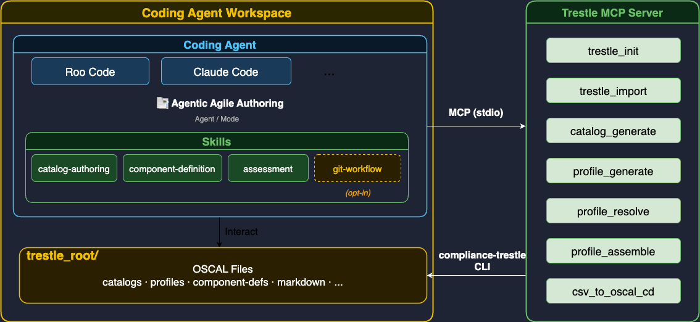
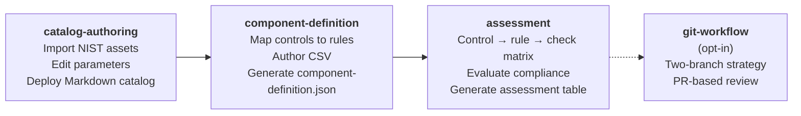

# Architecture

## High-Level Overview

**Agentic Agile Authoring** is an AI-assisted approach to OSCAL compliance authoring — from NIST catalog customization through component definition to assessment result generation. As a concrete artifact, it is a set of agent skills that enable a coding agent (Claude Code or Roo Code) to carry out this authoring work on behalf of the user.

The agent handles the full authoring lifecycle through a combination of direct file editing, content authoring assistance, and OSCAL tooling. It reads and writes OSCAL artifacts (catalogs, profiles, component definitions, markdown control docs) directly, helps the user craft compliant content, and calls the [Trestle MCP Server](https://github.com/oscal-compass/compliance-trestle-mcp) for structured OSCAL operations such as format conversion and profile resolution.

The coding agent workspace doubles as the `trestle_root` — the directory that `compliance-trestle` uses to store and manage OSCAL artifacts.

**Request flow:**

1. The user asks the coding agent to perform a compliance authoring task in natural language.
2. The agent selects the appropriate skill (catalog-authoring, component-definition, assessment, or git-workflow).
3. The skill guides the agent through the task — editing files, assisting with content, and calling Trestle MCP tools as needed.
4. When a Trestle MCP tool is called, the server translates it into a `compliance-trestle` CLI command run as a subprocess.
5. The CLI reads from and writes to the `trestle_root/` directory inside the workspace.

## OSCAL Authoring Lifecycle

The four skills cover the full OSCAL compliance authoring lifecycle from catalog definition through assessment.

| Skill | Input | Output |
|-------|-------|--------|
| `catalog-authoring` | NIST OSCAL catalog / profile URL | `catalog.json`, editable Markdown |
| `component-definition` | Catalog or profile + component description | `component-definition.json` |
| `assessment` | Component definition + scan results | Compliance assessment table (Markdown / OSCAL) |
| `git-workflow` | Compliance documents in workspace | Baseline branch, review PR |

## Trestle MCP Tools

The agent relies exclusively on the following MCP tools from [compliance-trestle-mcp](https://github.com/oscal-compass/compliance-trestle-mcp). Direct CLI invocation is never used.

| Tool | Used by skill | Description |
|------|--------------|-------------|
| `trestle_init` | catalog-authoring | Initialize a new trestle workspace |
| `trestle_import` | catalog-authoring | Import an OSCAL model from a URL or local file |
| `trestle_author_catalog_generate` | catalog-authoring | Generate editable Markdown from a catalog JSON |
| `trestle_author_profile_generate` | catalog-authoring | Generate editable Markdown from a profile |
| `trestle_author_profile_resolve` | catalog-authoring | Resolve a profile into a catalog with substituted parameters |
| `trestle_author_profile_assemble` | catalog-authoring | Assemble edited Markdown back into a Profile JSON |
| `trestle_task_csv_to_oscal_cd` | component-definition | Convert a CSV of control implementations into a Component Definition JSON |
