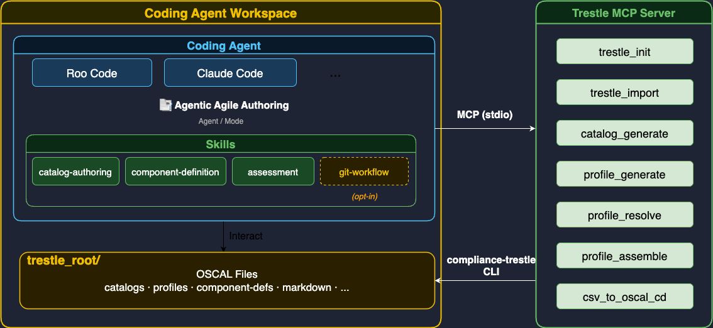
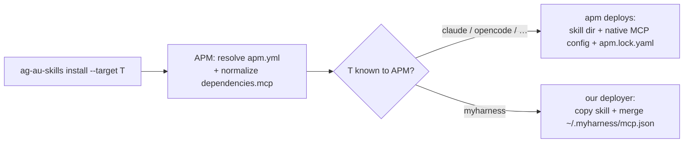

# Architecture

## High-Level Overview

**Agentic Agile Authoring** is an ecosystem of portable **skills** for OSCAL compliance
authoring — from NIST catalog customization through component definition to assessment result
generation. Each skill is a unit of authoring know-how that a coding agent (Claude Code, Roo
Code, opencode, …) loads and follows; there is no single orchestrator persona. Orchestration
across skills is expressed by **demos** (see below).

A skill handles authoring work through direct file editing, content-authoring assistance, and —
where needed — OSCAL tooling via the [Trestle MCP Server](https://github.com/oscal-compass/compliance-trestle-mcp).
A skill that requires an MCP server **declares** it in an `apm.yml` sidecar; nothing about the
server is hardcoded into an agent.

The coding agent workspace doubles as the `trestle_root` — the directory `compliance-trestle`
uses to store and manage OSCAL artifacts.

**Request flow:**

1. The user asks the coding agent to perform a compliance authoring task in natural language.
2. The harness activates the appropriate skill (`catalog-authoring`, `component-definition`,
   `assessment`, or `git-workflow`) directly from its description.
3. The skill guides the agent through the task — editing files, assisting with content, and
   calling Trestle MCP tools as needed.
4. When a Trestle MCP tool is called, the server translates it into a `compliance-trestle` CLI
   command run as a subprocess.
5. The CLI reads from and writes to the `trestle_root/` directory inside the workspace.

## Installation & MCP wiring

Installation is handled by `ag-au-skills`, a **thin wrapper** (in `tools/`) over
[Microsoft APM](https://github.com/microsoft/apm) (`apm-cli`). APM is the engine — it copies the
skill package into each harness's native dir **and** wires the skill's declared MCP servers into
that harness's native MCP config, with a lockfile and non-destructive uninstall/prune. The
wrapper adds only what APM lacks:

- **Selection** — `--skill` / `--exclude` / `--demo <name>` resolve to a set of skill packages
  (`--demo` reads the `skills:` set from `demos/<name>/README.md`); APM has no concept of
  our demos.
- **Stable UX + prereq policy** — hides APM's project mechanics and checks the baseline `uv`.
- **Custom-harness (MyHarness) deployment** — APM's target set is closed, so for a custom harness
  the wrapper reuses APM's target-agnostic resolve/normalize as a library and does the deployment
  itself.

```mermaid
graph LR
    A["ag-au-skills install --target T"] --> B["APM: resolve apm.yml<br/>+ normalize dependencies.mcp"]
    B --> C{"T known to APM?"}
    C -->|"claude / opencode / …"| D["apm deploys:<br/>skill dir + native MCP config + apm.lock.yaml"]
    C -->|"myharness"| E["our deployer:<br/>copy skill + merge ~/.myharness/mcp.json"]
```

Per-harness placement + MCP format is APM's (verified): Claude → `.claude/skills/` + `.mcp.json`
(`mcpServers`); OpenCode → `.agents/skills/` + `opencode.json` (`mcp.<name> = {type: local,
command:[…]}`). A shared MCP server is pruned only when no remaining installed skill declares it,
and user-authored skills / user-defined MCP servers are never touched. Skill identity is the
directory name; "has it changed?" is APM's `apm.lock.yaml` content hash — no bespoke versioning.
See the [decision log](design-spec.md#9-decision-log) (D4) for why we adopt APM.

## Skills

The four skills cover the OSCAL compliance authoring lifecycle. They compose (catalog →
component → assessment) but are invoked independently; a demo carries any ordering.

| Skill | Input | Output | MCP dep |
|-------|-------|--------|---------|
| `catalog-authoring` | NIST OSCAL catalog / profile URL | `catalog.json`, editable Markdown | `trestle` |
| `component-definition` | Catalog or profile + component description | `component-definition.json` | `trestle` |
| `assessment` | Component definition + scan results | Compliance assessment table (Markdown / OSCAL) | — |
| `git-workflow` | Compliance documents in workspace | Baseline branch, review PR | — |

## Demos

A demo (`demos/<name>/`) is an end-to-end walkthrough over N skills, captured as a single
`README.md`: frontmatter declaring the skill set (used by `--demo`), a demo video, the install
steps, the prompts to give the agent in order (with what each produces), and uninstall. The
walkthrough itself is the spec; a run "passes" when it reproduces the described artifacts (e.g. the
generated `catalog.json` passes `trestle validate`). See `catalog-to-assessment` for the first
demo, and the [Design Spec](design-spec.md) §4 for the model.

## Trestle MCP tools (per-skill dependency reference)

The skills that declare the `trestle` MCP dependency rely on these tools from
[compliance-trestle-mcp](https://github.com/oscal-compass/compliance-trestle-mcp). Direct CLI
invocation is never used from within a skill.

| Tool | Used by skill | Description |
|------|--------------|-------------|
| `trestle_init` | catalog-authoring | Initialize a new trestle workspace |
| `trestle_import` | catalog-authoring | Import an OSCAL model from a URL or local file |
| `trestle_author_catalog_generate` | catalog-authoring | Generate editable Markdown from a catalog JSON |
| `trestle_author_profile_generate` | catalog-authoring | Generate editable Markdown from a profile |
| `trestle_author_profile_resolve` | catalog-authoring | Resolve a profile into a catalog with substituted parameters |
| `trestle_author_profile_assemble` | catalog-authoring | Assemble edited Markdown back into a Profile JSON |
| `trestle_task_csv_to_oscal_cd` | component-definition | Convert a CSV of control implementations into a Component Definition JSON |

These tool→skill rows are the reference behind the `dependencies.mcp: [trestle]` declarations in
the `catalog-authoring` and `component-definition` sidecars.
